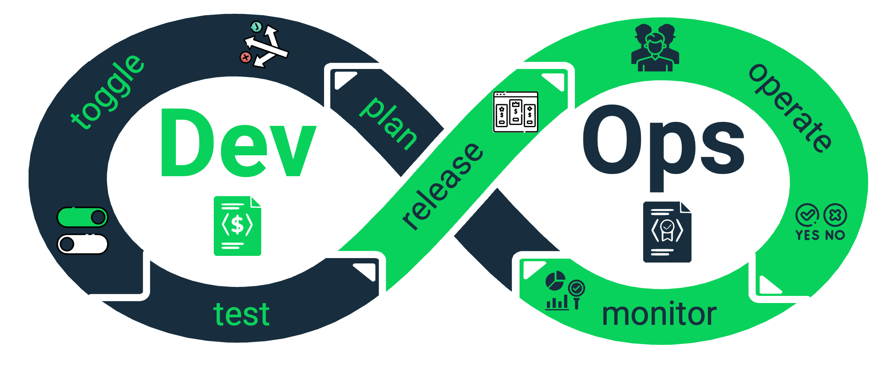
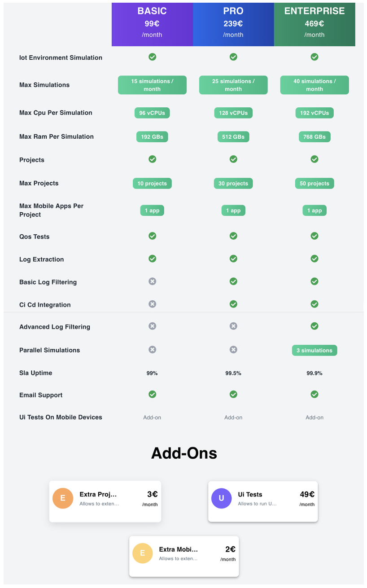

# Autoadaptación Dirigida por Planes de Precios (Pricing-Driven Self-Adaptation)

## 📚 Índice

1. [🧭 ¿Por qué existe este repositorio?](#-por-qu%C3%A9-existe-este-repositorio)
    
2. [🎯 Competencias que adquirirás](#-competencias-que-adquir%C3%A1s)
    
3. [🚀 ¿Dónde está la dificultad?](#-d%C3%B3nde-est%C3%A1-la-dificultad)
    
4. [🔧 ¿Cómo lo abordamos?](#-c%C3%B3mo-lo-abordamos)
    
    - [🧩 1. Modelar el pricing como artefacto ejecutable](#-1-modelar-el-pricing-como-artefacto-ejecutable)
        
    - [🏗️ 2. Diseñar una arquitectura que haga cumplir el iPricing en tiempo real](#%25EF%25B8%258F-2-dise%C3%B1ar-una-arquitectura-que-haga-cumplir-el-ipricing-en-tiempo-real)
        
5. [✅ Criterios de éxito del alumno](#-criterios-de-%C3%A9xito-del-alumno)
    
6. [🧭 ¿Qué solución proponemos?](#-qu%C3%A9-soluci%C3%B3n-proponemos)

7. [⚖️ Aviso Legal](#-aviso-legal)


## 🧭 ¿Por qué existe este repositorio?

El desarrollo de aplicaciones _Cloud-Native_ (CNA) ya no consiste solo en desplegar funcionalidades. En el mercado actual, el éxito de una aplicación depende de su **capacidad para adaptarse automáticamente a las necesidades del negocio y a la competencia**.

Estas necesidades se expresan, principalmente, mediante su **estructura de precios (pricing)**, que define:

- Qué características se ofrecen
    
- En qué planes o configuraciones
    
- Con qué límites de uso
    
- A qué precio y bajo qué condiciones  

Los _pricings_ se han convertido en un elemento central del negocio digital. Estudios recientes demuestran no solo que el número de configuraciones posibles en aplicaciones SaaS ha crecido **más de un 200% en los últimos años**, impulsado principalmente por el aumento de _add-ons_; sino que además los _pricings_ son altamente **volátiles**, es decir, cambian con frecuencia para adaptarse al mercado y a la competencia. Esta combinación de complejidad y volatilidad ha generado un problema real en la industria:

> [!WARNING]
> **Los sistemas actuales no pueden adaptarse automáticamente cuando cambia el pricing.** Cada modificación debe implementarse manualmente por los desarrolladores, generando una de los peores tipos de deuda técnica, que provoca: despliegues lentos, errores recurrentes y pérdida directa de competitividad.

Este repositorio ha sido creado para enseñarte, como futuro ingeniero/a, a **transformar un pricing de una tabla comercial estática a un artefacto capaz de controlar automáticamente el comportamiento de una aplicación cloud-native**. Es decir, aprenderás a usar el pricing como **motor de autoadaptación en tiempo real**, capaz de dirigir el desarrollo, la operación y la evolución del sistema sin intervención manual.

A esta nueva forma de construir software la llamamos: **Pricing-Driven Self-Adaptation**.


## 🎯 Competencias que adquirirás

Al implementar este paradigma en vuestro proyecto, desarrollaréis las siguientes habilidades clave:

| **Competencia**                                        | **Descripción**                                                                                                                       |
| ------------------------------------------------------ | ------------------------------------------------------------------------------------------------------------------------------------- |
| **Definir planes de precios como artefactos software** | Diseñar, representar y validar un pricing real utilizando la tecnología de SPHERE.                                                    |
| **Autoadaptación dirigida por planes de precios**      | Instrumentar una aplicación cloud-native para que adapte dinámicamente sus funcionalidades utilizando SPACE como motor de evaluación. |


## 🚀 ¿Dónde está la dificultad?

En una CNA típica, los planes de precios afectan directamente al comportamiento del sistema: qué funcionalidades tiene cada usuario, cuántas veces puede utilizarlas, qué garantías recibe, etc. Sin embargo, cuando el pricing cambia, **los ingenieros deben modificar manualmente el código, el despliegue, la infraestructura y las políticas de acceso**.

Según el análisis de más de 240 aplicaciones SaaS de distintos sectores (GitHub, Zoom, Salesforce, etc.):

- El número medio de _features_ por pricing ha aumentado un **98% desde 2019**
    
- El número de _add-ons_ ha crecido **más del 200%**, lo que provoca un incremento exponencial de configuraciones posibles
    
- **Ninguna herramienta industrial** actual soporta completamente la autoadaptación basada en _pricing_  

⚡ Esto convierte al _pricing-driven self-adaptation_ en un reto técnico real, de frontera y altamente relevante para la ingeniería de software del presente y del futuro.


## 🔧 ¿Cómo lo abordamos?

  
Este reto debe abordarse con **fundamentos de ingeniería del software**. Para ello, se debe seguir un enfoque sistemático en dos etapas:


### 🧩 1. Modelar el pricing como artefacto ejecutable

El primer paso es **transformar el pricing de un documento comercial estático** (normalmente redactado para el usuario final), **a un artefacto formal, "machine-oriented" y operable en tiempo de ejecución**.
  
Este artefacto se denomina **iPricing** (_intelligent pricing_) y permite que la aplicación entienda:

- Qué planes existen y qué funciones habilita cada uno

- Qué límites de uso se aplican

- Qué add-ons pueden complementar a cada plan

- Opciones de facturación

- ...


### 🏗️ 2. Diseñar una arquitectura que haga cumplir el iPricing en tiempo real

Una vez tenemos el iPricing, hay que diseñar una arquitectura que permita a la CNA adaptarse dinámicamente a lo que este modelo define. Esta solución debe resolver cuatro desafíos esenciales:

**1. Evaluación de acceso instantánea**

> [!NOTE]
> _¿Puede el usuario U acceder a la funcionalidad F?_


Cualquier microservicio debe poder responder a esta pregunta en tiempo real mediante llamadas como:

```ts
isFeatureAvailable("my-feature", "userId")
```

Esta las condiciones detrás de esta decisión no se programarán manualmente, si no que han de inferirse del iPricing y del contrato del usuario.


**2. Sincronización del estado de los contratos**

El sistema debe conocer en todo momento cuánto está utilizando cada usuario sus funcionalidades (es decir, el estado de cada contrato), independientemente del servicio o microservicio que las gestione.

Esto evita desincronizaciones que podrían permitir accesos indebidos o denegar accesos válidos.


**3. Seguridad**

La información sobre permisos de acceso debe propagarse de forma segura entre todos los componentes de la CNA, incluido el frontend.

> [!WARNING]
> No puede ser manipulable por el usuario final ni por ataques intermedios, ya que eso permitiría activar funcionalidades no contratadas.


**4. Cambios en tiempo real sin redespliegue**

Cuando el proveedor actualiza el pricing (por ejemplo, añade un nuevo add-on o cambia un límite de uso), la arquitectura debe:

- Actualizar automáticamente el iPricing (idealmente guardando una copia de la versión del mismo que ha sido sustituída)
    
- Propagar el cambio a toda la aplicación **sin necesidad de realizar un nuevo despliegue**


## ✅ Criterios de éxito del alumno

Para superar este módulo en la asignatura, tu proyecto deberá ser capaz de dar soporte a las siguientes historias de usuario (bien haciendo uso del ecosistema que ponemos a tu disposición, o a través de tu propia solución):

- **Como** usuario **quiero** seleccionar cualquier subscripción válida disponible en el plan de precios **para** usar la configuración que mejor satisface mis necesidades y se alinea con mi presupuesto.
- **Como** stackeholder de la CNA **quiero** modificar el pricing y que los cambios se apliquen automáticamente **para** mejorar la flexibilidad y capacidad de adaptación de la CNA.


## **🧭  ¿Qué solución proponemos?**

Como comentamos en la sección anterior, **no es obligatorio** utilizar la aproximación que estamos desarrollando en una de las líneas de investigación del grupo para superar la asignatura.  
Sin embargo, creemos que incorporar nuestra tecnología puede facilitaros el proceso de implementación de las historias de usuario relacionadas con la autoadaptación y aportaros una ventaja significativa (dashboards, control de versiones para el plan de precios, etc).

El propósito de esta sección es mostraros **el proceso de precioficación**, es decir, cómo aplicar el paradigma **pricing-driven DevOps** (desarrollo y operación dirigidos por planes de precios) dentro de vuestros proyectos. 

> [!TIP]
> Os animamos a aplicar este paradigma desde el inicio del proyecto.  Podéis comenzar con un pricing sencillo y mejorarlo progresivamente a medida que avanzáis.

La siguiente figura ilustra el ciclo de vida definido por **pricing-driven DevOps**, que deberéis seguir siempre que queráis definir o modificar un plan de precios:



### 🧪 Ejemplo práctico: CCSIM

Para ilustrar este proceso utilizaremos **CCSIM**, una aplicación real desarrollada por la Universidad de Extremadura y que ya se está comercializando. CCSIM es un SaaS que permite **probar infraestructuras del cloud continuum de forma virtual**, reduciendo el riesgo de realizar experimentos directamente sobre infraestructuras reales.

Si os interesa conocer la herramienta, podéis visitar su página web: [http://ccsim.spilab.es](http://ccsim.spilab.es)
### Fase 1: Diseño del plan de precios

Como en cualquier proceso DevOps, el punto de partida es la **planificación**, donde se diseña o ajusta el plan de precios (ya sea desde cero o a partir de uno existente).

> [!TIP]
> En la documentación de SPHERE encontraréis un **tutorial paso a paso** para crear un plan de precios equilibrado y competitivo, a partir de las características de vuestro proyecto. 
> 
> 📘 [Acceder al tutorial de diseño de pricings](https://sphere-docs.vercel.app/docs/2.0.1/docs/pricing-design).
> 
> **Tiempo estimado:** 45 mins

Como resultado de esta fase, obtuvimos el siguiente plan de precios para CCSIM:



### Fase 2: Transformación de pricing a iPricing

El corazón del ciclo de vida **pricing-driven DevOps** es el **iPricing**, una representación "orientada a máquina" del plan de precios.

En el grupo hemos desarrollado una sintaxis propia con este propósito: [Pricing2Yaml](https://sphere-docs.vercel.app/docs/2.0.1/api/pricing-description-languages/Pricing2Yaml/versions/pricing2yaml-v30-specification). Como su nombre indica, permite representar un plan de precios en un archivo YAML estructurado.

> [!TIP]
> Podéis seguir el **tutorial de Pricing2Yaml** para crear un iPricing a partir del pricing que hayáis diseñado en la fase anterior. 
> 
> 📘 [Acceder al tutorial de Pricing2Yaml](https://sphere-docs.vercel.app/docs/2.0.1/docs/pricing2yaml)
> 
> **Tiempo estimado:** 30 mins
>
> Además, para facilitaros este paso, SPHERE incluye una **herramienta interactiva** con las siguientes ventajas:
> 
> - Tiene un pricing completo de ejemplo que podéis usar como base para definir el vuestro.
> - Renderiza el plan de precios en tiempo real a medida que escribís.
> - Detecta errores sintácticos automáticamente, evitando problemas al final del proceso.
>
> Podéis acceder al editor aquí:
> 
> 👉 [Editor Pricing2Yaml](https://sphere.score.us.es/editor).

El resultado para CCSIM fue el siguiente iPricing:

```yaml
saasName: CCSIM
syntaxVersion: "3.0"
createdAt: "2025-10-28"
version: "1.0"
url: http://ccsim.spilab.es/
currency: EUR

billing:
  monthly: 1
  annual: 0.83

features:
  iotEnvironmentSimulation:
    description: IoT Environment Simulation
    valueType: BOOLEAN
    defaultValue: true
    expression: subscriptionContext['maxSimulations'] < pricingContext['usageLimits']['maxSimulations']
    serverExpression: subscriptionContext['maxSimulations'] <= pricingContext['usageLimits']['maxSimulations']
    type: DOMAIN

  projects:
    description: Projects
    valueType: BOOLEAN
    defaultValue: true
    expression: subscriptionContext['maxProjects'] < pricingContext['usageLimits']['maxProjects']
    serverExpression: subscriptionContext['maxProjects'] <= pricingContext['usageLimits']['maxProjects']
    type: MANAGEMENT

  qosTests:
    description: QoS Tests
    valueType: BOOLEAN
    defaultValue: true
    expression: pricingContext['features']['qosTests']
    type: DOMAIN

  logExtraction:
    description: Log Extraction
    valueType: BOOLEAN
    defaultValue: true
    expression: pricingContext['features']['logExtraction']
    type: DOMAIN

  basicLogFiltering:
    description: Basic Log Filtering
    valueType: BOOLEAN
    defaultValue: false
    expression: pricingContext['features']['basicLogFiltering']
    type: AUTOMATION
    automationType: FILTERING

  ciCdIntegration:
    description: CI/CD Integration
    valueType: BOOLEAN
    defaultValue: false
    expression: pricingContext['features']['ciCdIntegration']
    type: INTEGRATION
    integrationType: API

  advancedLogFiltering:
    description: Advanced Log Filtering
    valueType: BOOLEAN
    defaultValue: false
    expression: pricingContext['features']['advancedLogFiltering']
    type: AUTOMATION
    automationType: FILTERING

  parallelSimulations:
    description: Parallel Simulation
    valueType: BOOLEAN
    defaultValue: false
    expression: pricingContext['features']['parallelSimulations'] && subscriptionContext['maxParallelSimulations'] < pricingContext['usageLimits']['maxParallelSimulations']
    type: AUTOMATION
    automationType: FILTERING

  slaUptime:
    description: SLA Uptime
    valueType: TEXT
    defaultValue: "99%"
    type: GUARANTEE

  emailSupport:
    description: slasom@unex.es
    valueType: BOOLEAN
    defaultValue: true
    type: SUPPORT

  uiTestsOnMobileDevices:
    description: Allows to run UI tests on simulated mobile devices
    valueType: BOOLEAN
    defaultValue: false
    type: DOMAIN

usageLimits:
  maxSimulations:
    description: ''
    valueType: NUMERIC
    defaultValue: 15
    unit: simulation
    period:
      value: 1
      unit: MONTH
    type: RENEWABLE
    linkedFeatures:
      - iotEnvironmentSimulation

  maxCpuPerSimulation:
    description: ''
    valueType: NUMERIC
    defaultValue: 96
    unit: vCPU
    type: NON_RENEWABLE
    trackable: false
    linkedFeatures:
      - iotEnvironmentSimulation

  maxRamPerSimulation:
    description: ''
    valueType: NUMERIC
    defaultValue: 192
    unit: GB
    type: NON_RENEWABLE
    trackable: false
    linkedFeatures:
      - iotEnvironmentSimulation

  maxProjects:
    description: ''
    valueType: NUMERIC
    defaultValue: 10
    unit: project
    type: NON_RENEWABLE
    trackable: true
    linkedFeatures:
      - projects

  maxMobileAppsPerProject:
    description: ''
    valueType: NUMERIC
    defaultValue: 1
    unit: app
    type: NON_RENEWABLE
    trackable: false
    linkedFeatures:
      - projects

  maxParallelSimulations:
    description: ''
    valueType: NUMERIC
    defaultValue: 0
    unit: simulation
    type: NON_RENEWABLE
    trackable: false
    linkedFeatures:
      - parallelSimulations

plans:
  BASIC:
    description: Basic plan
    price: 99.0
    unit: /month
    features: null
    usageLimits: null

  PRO:
    description: Pro plan
    price: 239.0
    unit: /month
    features:
      basicLogFiltering:
        value: true
      ciCdIntegration:
        value: true
      slaUptime:
        value: "99.5%"
    usageLimits:
      maxSimulations:
        value: 25
      maxCpuPerSimulation:
        value: 128
      maxRamPerSimulation:
        value: 512
      maxProjects:
        value: 30

  ENTERPRISE:
    description: Enterprise plan
    price: 469.0
    unit: /month
    features:
      basicLogFiltering:
        value: true
      ciCdIntegration:
        value: true
      advancedLogFiltering:
        value: true
      parallelSimulations:
        value: true
      slaUptime:
        value: "99.9%"
    usageLimits:
      maxSimulations:
        value: 40
      maxCpuPerSimulation:
        value: 192
      maxRamPerSimulation:
        value: 768
      maxProjects:
        value: 50
      maxParallelSimulations:
        value: 3

addOns:
  extraProject:
    description: Allows to extend the limit of projects by 1
    price: 3
    unit: /month
    usageLimitsExtensions:
      maxProjects:
        value: 1

  uiTests:
    description: Allows to run UI tests on simulated mobile devices
    price: 49
    unit: /month
    features:
      uiTestsOnMobileDevices:
        value: true

  extraMobileApp:
    description: Allows to extend the limit of mobile apps stored by project by 1
    price: 2
    unit: /month
    usageLimitsExtensions:
      maxMobileAppsPerProject:
        value: 1

```

> [!TIP]
> Recordad seguir siempre las [buenas prácticas de modelado](https://sphere-docs.vercel.app/docs/2.0.1/api/pricing-description-languages/Pricing2Yaml/good-practices) recomendadas para pricing2Yaml.
### Fase 3: Subida del pricing a SPHERE

**SPHERE** es la plataforma que centraliza todos los servicios desarrollados en la línea de investigación sobre pricing-driven DevOps.

Además del editor y renderizador, SPHERE actúa como:

- **Sistema de control de versiones** para vuestros planes de precios.
- **Motor de análisis**, capaz de calcular métricas y generar infografías de las mismas.

> [!NOTE]
> Podéis acceder a SPHERE aquí:
> 
> 👉 [https://sphere.score.us.es](https://sphere.score.us.es)

Si tenéis dudas sobre cómo subir vuestro pricing y gestionar sus versiones, podéis consultar la guía correspondiente:

📘 [Crear y versionar un pricing con SPHERE](https://sphere-docs.vercel.app/docs/2.0.1/api/sphere/user-guides/create-pricing)

Como resultado de esta fase, el _pricing_ de CCSIM quedó publicado en SPHERE:

🔗 [CCSIM en SPHERE](https://sphere.score.us.es/pricings/sphere/CCSIM?collectionName=SphereLab)

Además de almacenar el modelo, SPHERE permite:

- Compartir el pricing (por ejemplo, con los profesores).
- Consultar métricas como el **espacio de configuración**, la **suscripción más barata y más cara**, o la **evolución de indicadores** a lo largo del tiempo.  
### Fase 4: Autoadaptar vuestro proyecto dirigido por el pricing

Una vez que tenéis vuestro _pricing_ definido, transformado a formato máquina y subido a SPHERE, llega el momento de **integrarlo en vuestro proyecto**.

Para ello utilizamos **SPACE**, un motor que evalúa el acceso a las funcionalidades de vuestro servicio en función de las condiciones del plan de precios activo.

En la documentación de SPHERE encontraréis las instrucciones para integrarlo:

📘 [Introducción a SPACE](https://sphere-docs.vercel.app/docs/2.0.1/api/space/introduction).


> [!TIP]
> Hemos preparado un laboratorio guiado para ayudaros a completar esta integración. Incluye un vídeo explicativo con la solución. 
> 
> 🔗 [Acceder al laboratorio](https://sphere-docs.vercel.app/docs/2.0.1/docs/space)
> 
> **Tiempo estimado:** 1 hora

### Fase 5: Mantener vuestro pricing

Una vez integrada la primera versión, **actualizar el plan de precios es un proceso sencillo**:

1. Modificar el iPricing.
2. Guardar la nueva versión (idealmente en SPHERE)
3. Cargar la versión actualizada en SPACE.

A partir de ahí, el sistema se **autoadaptará automáticamente** para reflejar las condiciones del nuevo plan de precios, sin necesidad de tocar el código fuente.

### ✨ Conclusión

Este proceso no solo os ayudará a cumplir con los requisitos de la asignatura, sino que también os permitirá **experimentar con un enfoque moderno y realista** del desarrollo de software como servicio.  
Al finalizar, habréis aprendido a **diseñar, implementar y mantener** planes de precios inteligentes que guían la evolución de vuestras propias aplicaciones.

## ⚖️ Aviso legal

El contenido de esta documentación ha sido **diseñado y redactado por el grupo de investigación ISA (Ingeniería del Software Aplicada)**, que posee **todos los derechos de copyright** sobre el mismo.

Este repositorio se distribuye bajo la licencia [MIT License](./LICENSE). Esto significa que podéis usar, modificar y distribuir el material con libertad, siempre que se mantenga la atribución original al grupo ISA y no se elimine esta nota de copyright.

© Grupo ISA, Universidad de Sevilla. Todos los derechos reservados.
